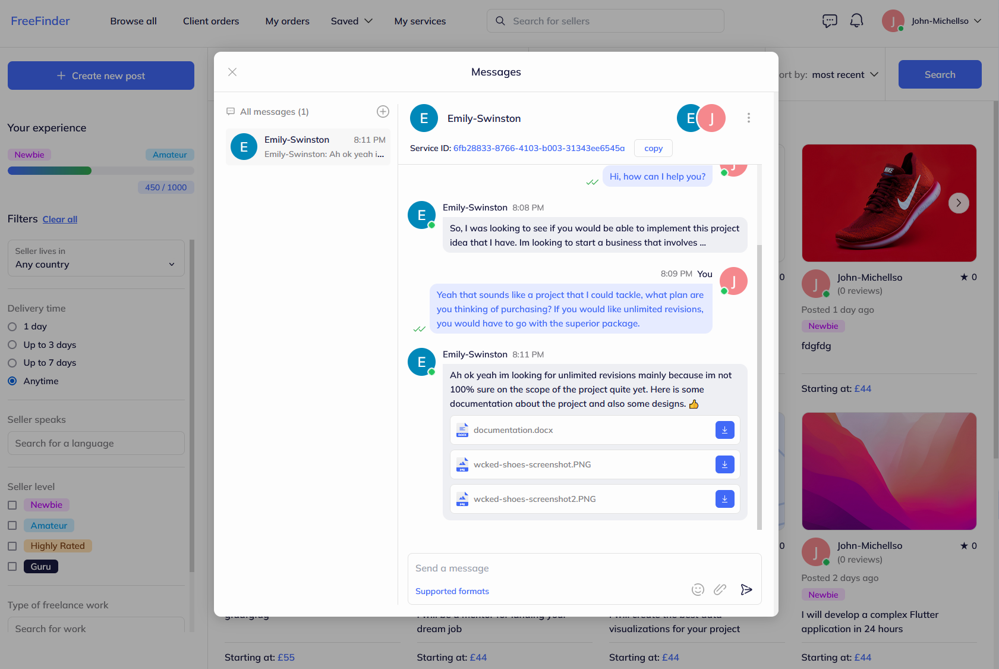

# FreeFinder

### A full stack job posting web app that offers the ability to communicate with sellers in real-time. You can receive real-time notifications to keep up to date with your saved services, new order requests, and much more! Users are able to request orders and invite multiple users to a chat group for group projects, among many other features!

Technologies used:
- PostgreSQL
- Express
- React (with Typescript)
- Node.js
- Cloudinary
- Socket IO
- Prisma
- Tailwind CSS

## Setting up the project locally

1. clone this project
2. cd into the 'frontend' folder and run 'npm install' in the terminal, repeat for the 'db' folder to install all necessary dependencies.
3. read the 'env_sample.txt' file in the 'db' directory and fill in all environment variables in the '.env' file (you will need a Cloudinary account to get your Cloudinary API Key, secret, and cloud name).  

## Running the project locally

1. cd into the 'frontend' folder and run 'npm start' in the terminal. This will spin up the frontend of the application on 'localhost:3000'.
2. cd into the 'db' folder and run 'npm run devStart'. This custom script will run 'nodemon index.js' to spin up the backend server on 'localhost:8000'
unless a different PORT environment variable is specified.

## Find a bug?

If you found an issue or would like to contribute to this project, please raise an issue first before making a pull request. When you submit a PR, reference the issue you created so I know what you fixed.